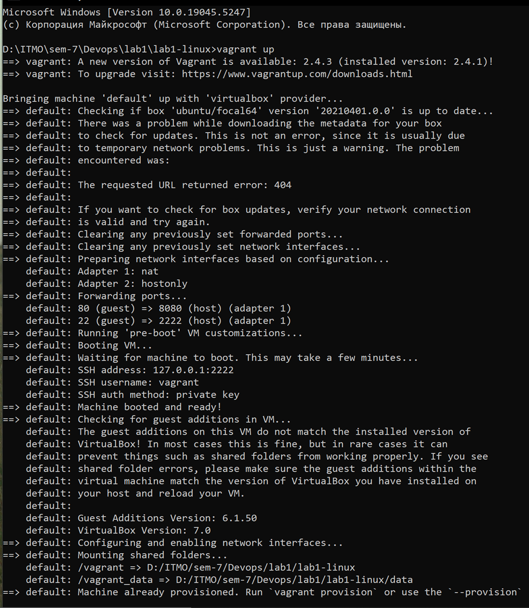

# Лабораторная №1

## Развертывание
`Vagrantfile`
```vagrantfile
Vagrant.configure("2") do |config|
  config.vm.box = "ubuntu/focal64"
  
  
  config.vm.network "forwarded_port", guest: 80, host: 8080


  config.vm.network "private_network", ip: "192.168.33.10"
  config.vm.synced_folder "./data", "/vagrant_data"
  
end
```



`inventory.ini` для развернутого хоста
```ini
[app]
192.168.33.10
```

*group_vars* для группы app `group_vars/app.yaml`

```yaml
ansible_user: vagrant
ansible_ssh_private_key_file: ../private_keys/devops_vagrant_key
container_name: locallib
container_ports: "8000:8000"
```

## Установка Docker на хост
`install_docker.yml`

```yml
- hosts: app
  become: yes
  tasks:
    - name: update
      apt:
        update_cache: yes
    - name: Установить зависимости
      apt:
        name: 
          - apt-transport-https
          - ca-certificates
          - curl
          - software-properties-common
        state: present

    - name: Добавить Docker GPG ключ
      apt_key:
        url: https://download.docker.com/linux/ubuntu/gpg
        state: present

    - name: Добавить Docker репозиторий
      apt_repository:
        repo: deb [arch=amd64] https://download.docker.com/linux/ubuntu focal stable

    - name: Установить Docker
      apt:
        name: docker-ce
        state: latest

    - name: Убедиться, что Docker запущен
      service:
        name: docker
        state: started
        enabled: true
```


## Запуск приложения на хосте
`start_container.yml`

```yml
- hosts: app
  tasks:
    - name: Убедиться, что git установлен
      become: yes
      apt:
        name: git
        state: present
        
    - name: start
      community.docker.docker_container:
        name: "{{ container_name }}"
        image: timurbabs/django
        state: started
        ports:
          - "{{ container_ports }}"
```


Контейнер был запущен:
