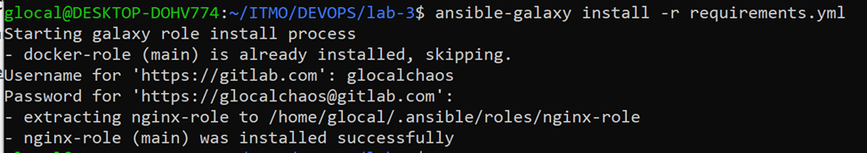
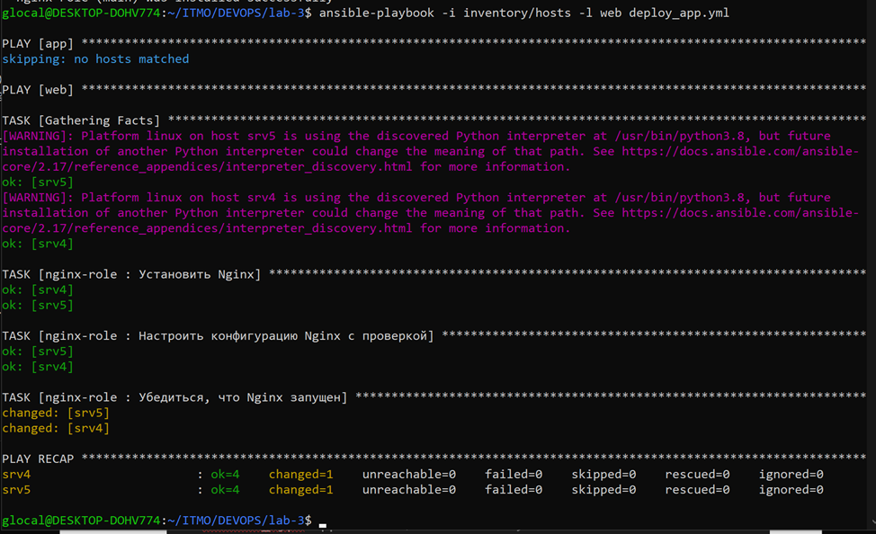
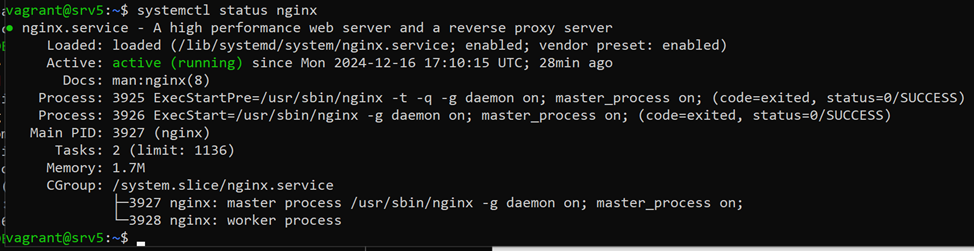
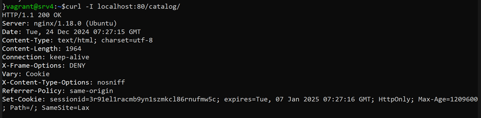

# Лабораторная рабоота №3
## Создание роли nginx
`main.yml`
```yml
---
# tasks file for nginx-role
- name: Установить Nginx
  apt:
    name: nginx
    state: present
  become: true

- name: Настроить конфигурацию Nginx с проверкой
  template:
    src: "{{ nginx_config_template }}"
    dest: /etc/nginx/nginx.conf
    validate: "nginx -t -c %s"
  become: true

- name: Убедиться, что Nginx запущен
  service:
    name: nginx
    state: restarted
    enabled: true
  become: true
```

`templates/nginx.conf.j2`

```
server {
    listen {{ nginx_port }} default_server;
    listen [::]:80 default_server ipv6only=on;
    
    server_name {{ nginx_server_name }};
    
    location /static/ {
        alias {{ static_files_path }};
    }

    location / {
        proxy_pass {{ proxy_pass }};
        proxy_set_header Host $host;
        proxy_set_header X-Real-IP $remote_addr;
        proxy_set_header X-Forwarded-For $proxy_add_x_forwarded_for;
        proxy_set_header X-Forwarded-Proto $scheme;
    }   
}        server_name {{ nginx_server_name }};

        location / {
            proxy_pass {{ proxy_pass }};
            proxy_set_header Host $host;
            proxy_set_header X-Real-IP $remote_addr;
            proxy_set_header X-Forwarded-For $proxy_add_x_forwarded_for;
            proxy_set_header X-Forwarded-Proto $scheme;
        }

        location /static/ {
            alias {{ static_files_path }};
        }

    }
}
```

`defaults/main.yml`
```yml
---
# defaults file for nginx-role
nginx_port: 80
nginx_server_name: "localhost"
static_files_path: "/home/vagrant/app/catalog/static/"
proxy_pass: "http://localhost:8000"
nginx_config_template: "nginx.conf.j2"
available_config_src: "/etc/nginx/sites-available/default"
enabled_config_src: "/etc/nginx/sites-enabled/default"
```

## Настройка основного проекта
`requirements.yml`

```yml
---
- name: docker-role
  src: https://gitlab.com/ansible-roles9394643/docker-role/
  scm: git
  version: main

- name: nginx-role
  src: https://gitlab.com/ansible-roles9394643/nginx-role/
  scm: git
  version: main
```

Установка роли


`deploy_app.yml`
```yml
---
- hosts: app
  become: yes
  roles:
    - docker-role

  tasks:
    - name: Убедиться, что git установлен
      become: yes
      apt:
        name: git
        state: present
        
    - name: start
      community.docker.docker_container:
        name: "{{ container_name }}"
        image: timurbabs/django
        state: started
        ports:
          - "{{ container_ports }}"

- hosts: web
  become: yes
  roles:
    - nginx-role
```

`inventory/hosts`
```ini
[app]
srv3 ansible_host=192.168.56.203

[web]
srv4 ansible_host=192.168.56.204
srv5 ansible_host=192.168.56.205

[all:vars]
ansible_user=vagrant
ansible_ssh_private_key_file=~/.ssh/id_rsa
```

`group_vars/app.yml`
```yml
container_name: locallib
container_ports: "8000:8000"`
```

Запуск


Проверка работы на хостах

